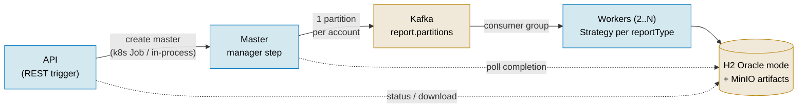

# Report Composer POC

A Proof of Concept for a **distributed Report Composer** that generates one report per
**account**, per **business date**, per **report type**, per **tenant (country)** — using
**Spring Batch Remote Partitioning** over **Apache Kafka**, running on **Kubernetes**
with autoscaling.

**Simple but functional:** the whole POC — **master and workers together** — runs on a
**single machine** with one command. The application **manages its own infrastructure**
(owns the Spring Batch lifecycle, provisions its Kafka topics, and creates the master
Job in k8s mode) and **auto-loads mock data on startup**, so you can generate a report
with a single API call — no manual data or topic setup.

> 📄 Full specification: [`docs/specs/Report_Composer_POC_PRD.md`](docs/specs/Report_Composer_POC_PRD.md).
> This project follows **Spec-Driven Development** — the PRD is the source of truth.

---

## What it does

A REST API triggers a **master** (Spring Batch manager step) that discovers eligible
accounts for a `(tenant, reportType, businessDate)` job, creates **one partition per
account**, and distributes those partitions over a **Kafka** consumer group to a pool of
**worker** pods. Each worker queries the account's transactions, builds a report using a
**Strategy** selected by `reportType`, uploads it to **MinIO**, and persists it
**idempotently**. A minimal frontend triggers jobs and shows live per-partition status.



## Key properties

- **One global `JobExecution`** per `(tenantId, reportType, businessDate)`.
- **One partition per `accountId`**; each worker consumer thread runs exactly one remote step.
- **Idempotent & restartable** — unique key on `report_work_unit`
  `(tenant, account, type, date)` + overwrite-by-key in MinIO; failed partitions restart
  without reprocessing completed ones.
- **Pluggable country onboarding = DB contract config only.** Insert a `tenant` row plus
  `tenant_report_contract` rows binding it to agreed report types — no rebuild, no
  redeploy. The **existing running workers** immediately pick up that tenant's jobs
  (workers are generic and resolve the strategy by `reportType` at runtime).
- **New report type = one new `ReportTypeStrategy` `@Component`** (Strategy pattern);
  tenants then contract it via a config row. Ships with `ACCOUNT_STATEMENT` and
  `TAX_SUMMARY`.
- **Contract enforcement at the boundary** — a job for a non-contracted
  `(tenant, reportType)` or an unregistered report type is rejected (400/404/409).
- **Autoscalable** worker pods via **HPA** (optional **KEDA** on Kafka consumer lag).
- **Self-managed infra** — provisions Kafka topics on startup (`KafkaAdmin`/`NewTopic`),
  owns the batch lifecycle, creates the master `Job` via Fabric8 in k8s mode, runs
  Flyway, and **auto-seeds mock data** (3 tenants × 50 accounts by default).

## Technology stack

| Concern        | Choice                                                     |
|----------------|------------------------------------------------------------|
| Language       | Java 21 (LTS)                                              |
| Build          | Maven (`./mvnw`)                                           |
| Framework      | Spring Boot 3.4.x                                          |
| Batch          | Spring Batch Remote Partitioning (`spring-batch-integration`) |
| Messaging      | Apache Kafka, KRaft mode (`spring-kafka`)                  |
| Database       | H2 in Oracle compatibility mode (TCP server), Flyway       |
| Object storage | MinIO (S3-compatible)                                      |
| K8s control    | Fabric8 Kubernetes Client (API spawns the master `Job`)    |
| Frontend       | Static HTML+JS (no build step), served by the API and nginx |
| Autoscaling    | HPA (CPU); optional KEDA `ScaledObject` on Kafka lag       |
| Observability  | Actuator, Micrometer/Prometheus, MDC job-key logging       |
| Tests          | JUnit 5 + Mockito, `spring-batch-test`, JaCoCo gate ≥ 80% line |
| CI             | GitHub Actions (build, test, coverage artifact, image)     |

## Quick start (Docker Compose — one machine)

Prerequisites: Docker + Compose v2 (and JDK 21 only if you build outside Docker).

```bash
./scripts/start.sh                 # Linux/macOS — wraps: docker compose up -d --build --scale worker=3
.\scripts\start.ps1                # Windows PowerShell
scripts\start.bat                  # Windows cmd
# or: make up
```

On first start the app **creates the Kafka topics, runs Flyway, and seeds mock data**
(tenants `BE`, `FR`, `ES`, ~50 accounts each with transactions on `2026-06-30`).

```bash
# Trigger a report job (uses the auto-seeded tenant + business date)
curl -X POST http://localhost:8080/api/v1/jobs \
  -H 'Content-Type: application/json' \
  -d '{"tenantId":"BE","reportType":"ACCOUNT_STATEMENT","businessDate":"2026-06-30"}'

curl http://localhost:8080/api/v1/jobs            # list executions + partition progress
curl http://localhost:8080/api/v1/jobs/1/partitions
./scripts/stop.sh                                 # or: make down
```

| URL                          | What                       |
|------------------------------|----------------------------|
| http://localhost:3000        | Frontend (also served at :8080/) |
| http://localhost:8080        | REST API                   |
| http://localhost:8080/swagger-ui.html | Swagger UI (interactive OpenAPI docs) |
| http://localhost:8080/v3/api-docs | OpenAPI spec (JSON)   |
| http://localhost:8080/health | Health (simple UP + timestamp) |
| http://localhost:8080/actuator | Actuator index (health details, info, metrics) |
| http://localhost:8080/actuator/prometheus | Prometheus metrics scrape |
| http://localhost:8080/api/v1/stats | System stats (counts, job/partition status, active worker pods) |
| http://localhost:8082        | Kafka UI (topics, consumer group lag) |
| http://localhost:9000        | MinIO S3 endpoint          |
| http://localhost:9001        | MinIO console (minioadmin/minioadmin) |
| http://localhost:8083        | H2 web console — JDBC URL `jdbc:h2:tcp://h2:1521//opt/h2-data/report;MODE=Oracle`, user `sa`, empty password |
| localhost:9093               | H2 TCP port (Oracle mode, for external SQL clients) |

All of these are also linked from the frontend's **System links** card.

Scale workers live: `docker compose up -d --scale worker=5`.

In Compose mode (`LAUNCHER_MODE=local`) the **manager step runs in-process in the `api`
service** while workers run as separate scaled containers — master and workers on the
same machine. The same image runs every role via `APP_ROLE=api|master|worker`.

## Local Kubernetes (minikube / kind)

```bash
./scripts/start.sh k8s     # or: make up-k8s
```

The script starts the cluster (minikube sized via `MINIKUBE_CPUS`/`MINIKUBE_MEMORY`,
defaults 4 CPUs / 5g — the POC runs several JVMs), enables metrics-server (HPA
dependency), builds and loads `report-composer:latest`, applies `k8s/` (namespace, RBAC,
H2, Kafka KRaft, MinIO, API, workers, HPA, Ingress; pods use small laptop-friendly
requests/limits), and port-forwards the API. The KEDA `ScaledObject` lives in
`k8s/optional/` (apply explicitly after installing KEDA); the master Job template lives
in `k8s/templates/` (consumed by the API, not `kubectl apply`). In k8s mode
(`LAUNCHER_MODE=k8s`) each `POST /api/v1/jobs` makes the API **create a master `Job`
through the Kubernetes API** (Fabric8, RBAC-scoped ServiceAccount); watch with
`kubectl -n report-composer get jobs,pods,hpa -w`.

## Start & stop scripts — what actually happens

Both scripts take a target: `compose` (default) or `k8s`. Windows equivalents
(`.ps1`/`.bat`) mirror the same behavior.

### `scripts/start.sh [compose]`

1. Resolves the compose command (`docker compose` plugin, falls back to standalone
   `docker-compose`) and pins `DOCKER_HOST` to the active docker context (colima-safe).
2. `docker compose up -d --build --scale worker=$WORKER_REPLICAS` (default 3) — builds
   the app image and starts, in dependency order: **Kafka** (KRaft, healthcheck) →
   **H2** TCP server (Oracle mode) → **MinIO** (+ one-shot `mc` job creating the
   `reports` bucket) → **api** → **workers** (wait for the api to be healthy) →
   **kafka-ui** and **frontend** (nginx).
3. On api startup the application initializes its own infrastructure:
   - **Kafka topics** `report.partitions` (10 partitions) and `report.replies`
     provisioned via `KafkaAdmin` — no manual topic creation;
   - **Flyway migrations**: V1 Spring Batch metadata schema, V2 app schema,
     V3 seed tenants (`BE`, `FR`, `ES`) + report contracts;
   - **mock data seeding** (api role only, only when the account table is empty):
     ~50 accounts per tenant with transactions on `SEED_BUSINESS_DATE`.
4. Waits for `http://localhost:8080/health` to return 200, then prints all URLs.

### `scripts/stop.sh [compose]`

`docker compose down -v` — stops and removes all containers, the network, **and the
volumes** (H2 data + MinIO artifacts are wiped; next start re-migrates and re-seeds
from scratch).

### `scripts/start.sh k8s`

1. Picks a running minikube/kind, else starts minikube
   (`--cpus $MINIKUBE_CPUS --memory $MINIKUBE_MEMORY`, defaults 4 / 5g) or creates a
   kind cluster.
2. Enables **metrics-server** (HPA dependency; patched with `--kubelet-insecure-tls`
   on kind).
3. Builds `report-composer:latest` and loads it into the cluster
   (`minikube image load` / `kind load docker-image`).
4. `kubectl apply -f k8s/` — namespace, ConfigMap/Secret, RBAC (ServiceAccount the API
   uses to create master Jobs), H2, Kafka, MinIO (+ bucket job), API + workers
   (with startup probes), worker HPA, Ingress.
5. Waits for the api rollout, then port-forwards `svc/report-composer-api` to
   `localhost:8080` and waits for `/health`. The same in-app initialization as compose
   (topics, Flyway, seed) runs inside the api pod.

### `scripts/stop.sh k8s`

Kills the background port-forward and `kubectl delete -f k8s/` (namespace and all
resources removed — DB/MinIO data gone with them). The cluster itself is left running;
tear it down with `minikube delete` / `kind delete cluster --name report-composer`.

## Command reference

| Command | What it does |
|---------|--------------|
| `./scripts/start.sh` / `make up` | Full stack via Docker Compose (build, 3 workers, health wait, prints URLs) |
| `./scripts/stop.sh` / `make down` | Compose down incl. volumes (wipes data) |
| `./scripts/start.sh k8s` / `make up-k8s` | Local Kubernetes path (minikube/kind + HPA + API-spawned master Jobs) |
| `./scripts/stop.sh k8s` / `make down-k8s` | Delete all k8s resources, keep the cluster |
| `WORKER_REPLICAS=5 ./scripts/start.sh` | Start compose with 5 workers |
| `docker compose up -d --scale worker=5` | Rescale workers live (compose) |
| `./mvnw -B verify` / `make test` | Build + all tests + JaCoCo ≥80% line gate |
| `./mvnw test -Dtest=JobServiceTest` | Single test class (`#method` for one test) |
| `make image` | Build the `report-composer:latest` image only |
| `curl -X POST localhost:8080/api/v1/jobs -H 'Content-Type: application/json' -d '{"tenantId":"BE","reportType":"ACCOUNT_STATEMENT","businessDate":"2026-06-30"}'` | Trigger a job |
| `curl localhost:8080/api/v1/jobs` | List jobs + partition progress |
| `curl localhost:8080/api/v1/jobs/{id}/partitions` | Per-account partition status |
| `curl -X POST localhost:8080/api/v1/jobs/{id}/restart` | Restart a FAILED job (completed partitions skipped) |
| `curl -OJ localhost:8080/api/v1/reports/{workUnitId}` | Download a generated report |
| `kubectl -n report-composer get jobs,pods,hpa -w` | Watch master Jobs / workers / autoscaling (k8s) |
| `kubectl -n report-composer logs -l app=report-composer-worker -f` | Tail worker logs (k8s) |
| `docker compose logs -f worker` | Tail worker logs (compose) |

## Build & test

```bash
./mvnw clean verify        # tests + JaCoCo ≥80% line coverage gate (or: make test)
./mvnw spring-boot:run     # api role, embedded H2 — needs local Kafka/MinIO for real runs
./mvnw test -Dtest=JobServiceTest        # single test class
```

## Onboarding a new tenant (config only — no redeploy)

```sql
INSERT INTO tenant (tenant_id, country_code, locale, currency, enabled, config_json)
VALUES ('NL', 'NL', 'nl-NL', 'EUR', TRUE, '{}');

INSERT INTO tenant_report_contract (tenant_id, report_type, enabled, effective_from)
VALUES ('NL', 'ACCOUNT_STATEMENT', TRUE, DATE '2026-01-01');
```

Seed its accounts/transactions (or point the eligible-account criteria at real data) and
the **already-running workers** process its jobs immediately. Adding a new **report
type** = one new `ReportTypeStrategy` `@Component`; tenants contract it with a row here.

## API (summary)

| Method | Path                           | Purpose                                  |
|--------|--------------------------------|------------------------------------------|
| POST   | `/api/v1/jobs`                 | Start a job (`tenantId`, `reportType`, `businessDate`) → 202 + `jobExecutionId` |
| GET    | `/api/v1/jobs`                 | List/filter executions (tenant/type/date/status) |
| GET    | `/api/v1/jobs/{id}`            | Job status + aggregate partition progress |
| GET    | `/api/v1/jobs/{id}/partitions` | Per-account (`report_work_unit`) status  |
| POST   | `/api/v1/jobs/{id}/restart`    | Restart a failed job (completed partitions skipped) |
| GET    | `/api/v1/reports`              | List generated documents (filter by tenant/type/date) |
| GET    | `/api/v1/reports/{workUnitId}` | Download a report from MinIO (`?inline=true` to preview) |
| GET    | `/api/v1/tenants`              | Tenants + their contracted report types  |
| POST   | `/api/v1/tenants`              | Onboard a tenant (optionally seed mock accounts + transactions) |
| POST   | `/api/v1/tenants/{id}/contracts` | Contract the tenant for a catalog report type |
| POST   | `/api/v1/tenants/{id}/transactions` | Generate random mock transactions for its accounts |
| GET    | `/api/v1/report-types`         | The agreed catalog (registered strategies) |
| GET    | `/api/v1/stats`                | Entity counts, job/partition status, artifact totals, **live worker pods** (Kafka consumer group) |
| GET    | `/health`, `/actuator/*`       | Health, metrics, Prometheus scrape       |

All responses carry a `timestamp`. Validation rejects unknown/disabled tenants,
non-contracted or unregistered report types, malformed dates, and duplicate in-flight
job keys.

## Project layout

```
report-composer-poc/
├── src/main/java/com/wallaceespindola/reportcomposer/
│   ├── api/          # controllers, DTOs, error handling
│   ├── batch/        # master (partitioner, manager step) + worker (tasklet, step)
│   ├── strategy/     # ReportTypeStrategy + resolver + 2 shipped strategies
│   ├── domain/       # JPA entities (tenant, contract, account, transaction, job, work unit, artifact)
│   ├── launcher/     # local (in-process) + k8s (Fabric8) master launchers, master runner
│   ├── service/      # job orchestration/validation, seeder, downloads
│   ├── storage/      # MinIO artifact storage
│   └── config/       # properties, Kafka topics/serde, MinIO, web, batch launchers
├── src/main/resources/db/migration/   # Flyway: batch schema, app schema, seed tenants
├── src/test/java/    # 71 tests: unit, batch slice, @WebMvcTest, H2-Oracle persistence
├── frontend/         # static UI (also copied into the jar and served at :8080)
├── k8s/              # namespace, RBAC, H2, Kafka, MinIO, API, workers, HPA, KEDA, Ingress
├── scripts/          # start/stop .sh/.ps1/.bat — compose (default) + k8s targets
├── .github/workflows/ci.yml
├── Dockerfile  ·  docker-compose.yml  ·  Makefile
└── docs/                # specs/Report_Composer_POC_PRD.md + diagrams/
```

## Diagrams

Full diagrams live in [`docs/diagrams/`](docs/diagrams/README.md) — each in **Mermaid**
(rendered inline by GitHub) and **PlantUML** (`.puml`, full UML notation):

| Diagram | What it shows |
|---------|---------------|
| [Architecture](docs/diagrams/README.md#architecture--deployment-prd-10) | Deployment topology: API, master Job, worker Deployment + HPA, Kafka, H2, MinIO |
| [Components](docs/diagrams/README.md#components) | Package responsibilities and the three extension interfaces (launcher, strategy, storage) |
| [Class](docs/diagrams/README.md#class-diagram--strategy-pattern--batch-core) | Strategy pattern, launchers, batch core, idempotency entities |
| [Sequence](docs/diagrams/README.md#job-lifecycle-sequence) | Job lifecycle: trigger → partition → Kafka → workers → report → status/download |
| [Data model ERD](docs/diagrams/README.md#data-model--erd-prd-8) | Tables, keys, and relationships — tenant/contract/account/transaction + job/work-unit/artifact |
| [Data model classes](docs/diagrams/README.md#data-model--jpa-entity-classes) | JPA entities with fields, enums, and the idempotency unique keys |

## Configuration

Everything is externalized via env vars (see PRD §13 and `.env.example`): `APP_ROLE`,
`LAUNCHER_MODE`, `DB_URL`, `KAFKA_*` (topics, partitions, concurrency), `SEED_*`
(enabled, accounts per tenant, business date), `MINIO_*`, `K8S_NAMESPACE`,
`MASTER_JOB_TEMPLATE`. Secrets come from `.env` / K8s `Secret` — never committed.

## License

See [LICENSE](LICENSE).

## Author

**Wallace Espindola**
- Email: wallace.espindola@gmail.com
- LinkedIn: https://www.linkedin.com/in/wallaceespindola/
- GitHub: https://github.com/wallaceespindola/
