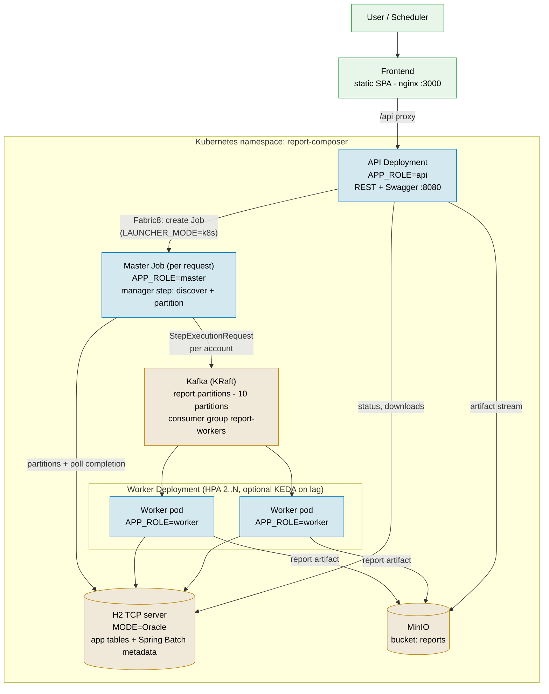
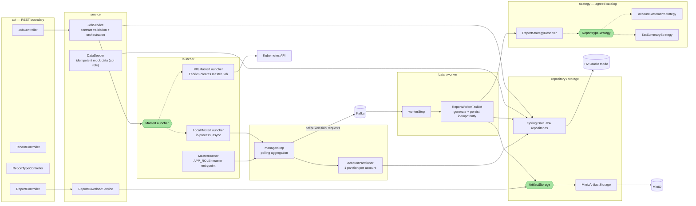
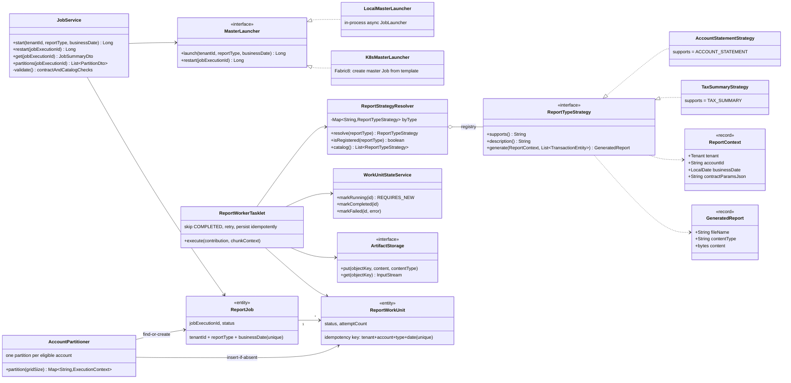
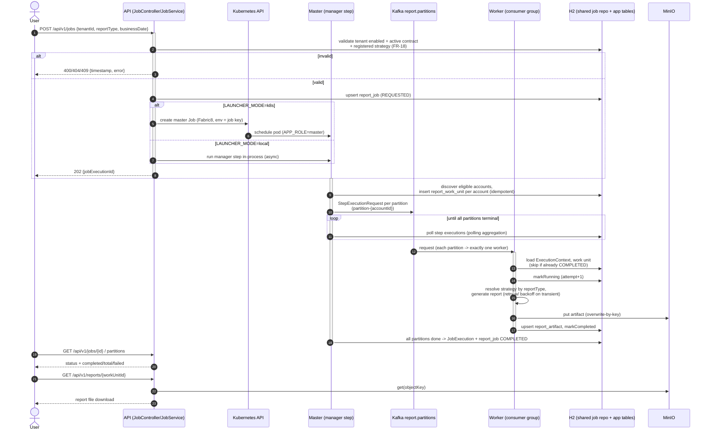

# Diagrams

Main diagrams for the Report Composer POC, each in two formats:

- **Mermaid** (`.mmd`) — rendered inline below (GitHub renders Mermaid natively).
- **PlantUML** (`.puml`) — full UML notation; render with `plantuml <file>.puml`
  or paste into https://www.plantuml.com/plantuml/uml/.

| Diagram | Mermaid | PlantUML |
|---------|---------|----------|
| Architecture / deployment | [architecture.mmd](architecture.mmd) | [architecture.puml](architecture.puml) |
| Components | [components.mmd](components.mmd) | [components.puml](components.puml) |
| Class (Strategy + batch core) | [class.mmd](class.mmd) | [class.puml](class.puml) |
| Job lifecycle sequence | [sequence.mmd](sequence.mmd) | [sequence.puml](sequence.puml) |

## Architecture / deployment (PRD §10)

Master and workers are the same image in different roles (`APP_ROLE`). In Compose mode
(`LAUNCHER_MODE=local`) the master step runs in-process in the API container instead of
a Kubernetes Job.

Legend: blue = application (one image, role via `APP_ROLE`), gold = infrastructure,
green = edge/UI.

## Components

Package = responsibility. Hexagons are interfaces (extension points): `MasterLauncher`
(local vs k8s), `ReportTypeStrategy` (the agreed report-type catalog), `ArtifactStorage`.

## Class diagram — Strategy pattern + batch core

Adding a report type = one new `@Component` implementing `ReportTypeStrategy`; nothing
else changes (PRD §7). Idempotency lives in `ReportWorkUnit`'s unique key.

## Job lifecycle sequence

Trigger → validate → launch master (k8s Job or in-process) → one partition per account
over Kafka → workers generate + persist idempotently → master polls completion → status
and download via the API. Restart re-runs only failed partitions (FR-9).

